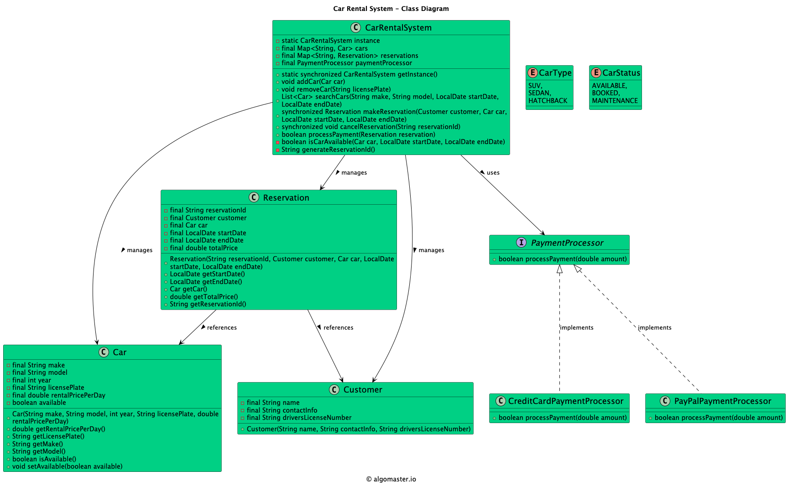

# Designing a Car Rental System

## Requirements
1. The car rental system should allow customers to browse and reserve available cars for specific dates.
2. Each car should have details such as make, model, year, license plate number, and rental price per day.
3. Customers should be able to search for cars based on various criteria, such as car type, price range, and availability.
4. The system should handle reservations, including creating, modifying, and canceling reservations.
5. The system should keep track of the availability of cars and update their status accordingly.
6. The system should handle customer information, including name, contact details, and driver's license information.
7. The system should handle payment processing for reservations.
8. The system should be able to handle concurrent reservations and ensure data consistency.

## UML Class Diagram

## Implementations
#### [Java Implementation](../solutions/java/src/carrentalsystem/) 
#### [Python Implementation](../solutions/python/carrentalsystem/)
#### [C++ Implementation](../solutions/cpp/carrentalsystem/)
#### [C# Implementation](../solutions/csharp/carrentalsystem/)
#### [Go Implementation](../solutions/golang/carrentalsystem/)

## Classes, Interfaces and Enumerations
1. The **Car** class represents a car in the rental system, with properties such as make, model, year, license plate number, rental price per day, and availability status.
2. The **Customer** class represents a customer, with properties like name, contact information, and driver's license number.
3. The **Reservation** class represents a reservation made by a customer for a specific car and date range. It includes properties such as reservation ID, customer, car, start date, end date, and total price.
4. The **PaymentProcessor** interface defines the contract for payment processing, and the CreditCardPaymentProcessor and PayPalPaymentProcessor classes are concrete implementations of the payment processor.
5. The **RentalSystem** class is the core of the car rental system and follows the Singleton pattern to ensure a single instance of the rental system.
6. The RentalSystem class uses concurrent data structures (ConcurrentHashMap) to handle concurrent access to cars and reservations.
7. The **RentalSystem** class provides methods for adding and removing cars, searching for available cars based on criteria, making reservations, canceling reservations, and processing payments.
8. The **CarRentalSystem** class serves as the entry point of the application and demonstrates the usage of the car rental system.