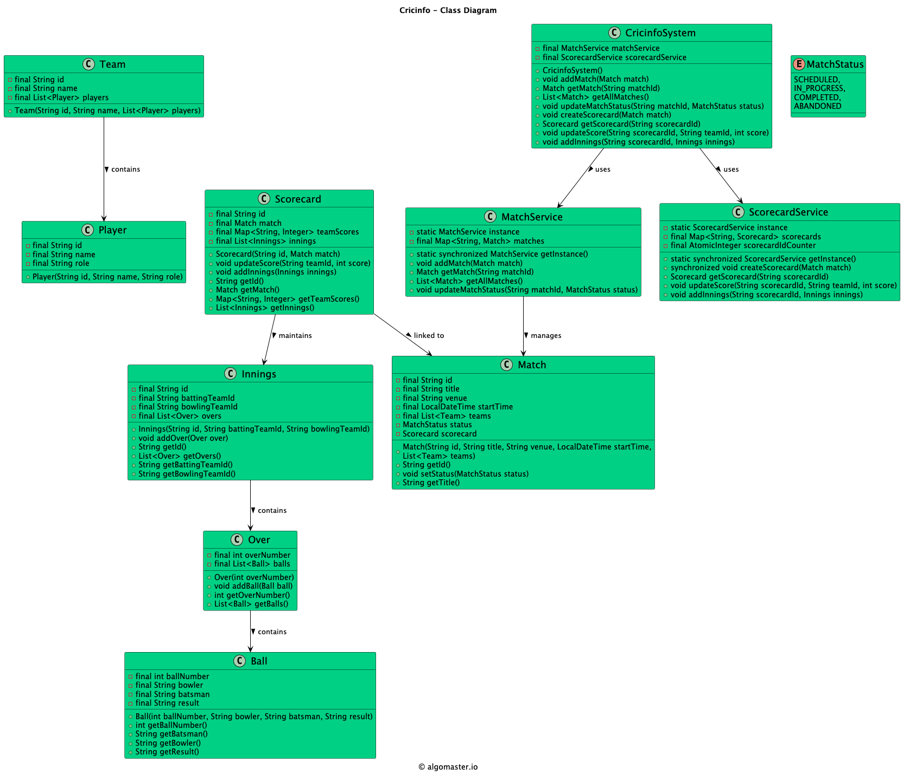

# Designing a Cricket Information System like CricInfo

## Requirements
1. The Cricinfo system should provide information about cricket matches, teams, players, and live scores.
2. Users should be able to view the schedule of upcoming matches and the results of completed matches.
3. The system should allow users to search for specific matches, teams, or players.
4. Users should be able to view detailed information about a particular match, including the scorecard, commentary, and statistics.
5. The system should support real-time updates of live scores and match information.
6. The system should handle concurrent access to match data and ensure data consistency.
7. The system should be scalable and able to handle a large volume of user requests.
8. The system should be extensible to accommodate new features and enhancements in the future.

## UML Class Diagram

## Implementations
#### [Java Implementation](../solutions/java/src/cricinfo/) 
#### [Python Implementation](../solutions/python/cricinfo/)
#### [C++ Implementation](../solutions/cpp/cricinfo/)
#### [C# Implementation](../solutions/csharp/cricinfo/)
#### [Go Implementation](../solutions/golang/cricinfo/)

## Classes, Interfaces and Enumerations
1. The **Match** class represents a cricket match, with properties such as ID, title, venue, start time, teams, status, and scorecard.
2. The **Team** class represents a cricket team, with properties like ID, name, and a list of players.
3. The **Player** class represents a cricket player, with properties such as ID, name, and role.
4. The **Scorecard** class represents the scorecard of a match, containing team scores and a list of innings.
5. The **Innings** class represents an innings in a match, with properties like ID, batting team, bowling team, and a list of overs.
6. The **Over** class represents an over in an innings, containing a list of balls.
7. The **Ball** class represents a ball bowled in an over, with properties such as ball number, bowler, batsman, and result.
8. The **MatchStatus** enum represents the different statuses of a match, such as scheduled, in progress, completed, or abandoned.
9. The **MatchService** class manages the matches in the system, providing methods to add, retrieve, and update match information. It follows the Singleton pattern to ensure a single instance of the service.
10. The **ScorecardService** class manages the scorecards of matches, allowing the creation, retrieval, and update of scorecards and their associated data, such as innings and scores. It also follows the Singleton pattern.
11. The **CricinfoSystem** class serves as the main entry point of the system, integrating the match and scorecard services and providing high-level methods for interacting with the system.