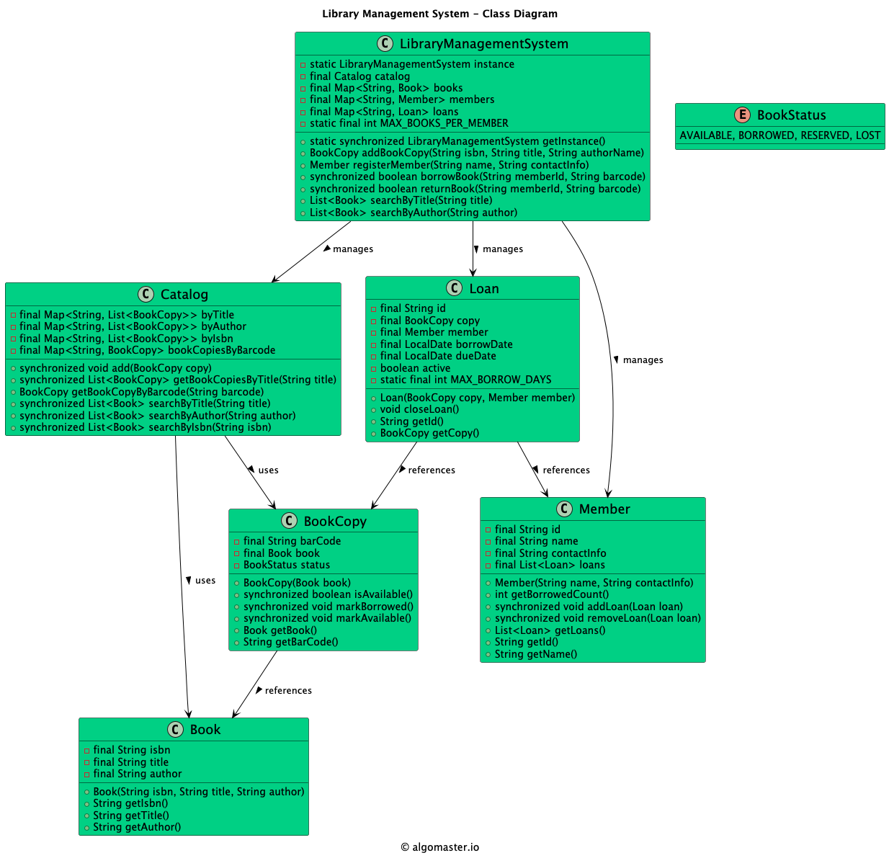

# Designing a Library Management System

## Requirements
1. The library management system should allow librarians to manage books, members, and borrowing activities.
2. The system should support adding, updating, and removing books from the library catalog.
3. Each book should have details such as title, author, ISBN, publication year, and availability status.
4. The system should allow members to borrow and return books.
5. Each member should have details such as name, member ID, contact information, and borrowing history.
6. The system should enforce borrowing rules, such as a maximum number of books that can be borrowed at a time and loan duration.
7. The system should handle concurrent access to the library catalog and member records.
8. The system should be extensible to accommodate future enhancements and new features.

## UML Class Diagram

## Implementations
#### [Java Implementation](../solutions/java/src/librarymanagementsystem/) 
#### [Python Implementation](../solutions/python/librarymanagementsystem/)
#### [C++ Implementation](../solutions/cpp/librarymanagementsystem/)
#### [C# Implementation](../solutions/csharp/librarymanagementsystem/)
#### [Go Implementation](../solutions/golang/librarymanagementsystem/)

## Classes, Interfaces and Enumerations
1. The **Book** class represents a book in the library catalog, with properties such as ISBN, title, author, publication year, and availability status.
2. The **Member** class represents a library member, with properties like member ID, name, contact information, and a list of borrowed books.
3. The **LibraryManager** class is the core of the library management system and follows the Singleton pattern to ensure a single instance of the library manager.
4. The LibraryManager class uses concurrent data structures (ConcurrentHashMap) to handle concurrent access to the library catalog and member records.
5. The LibraryManager class provides methods for adding and removing books, registering and unregistering members, borrowing and returning books, and searching for books based on keywords.
6. The **LibraryManagementSystemDemo** class serves as the entry point of the application and demonstrates the usage of the library management system.