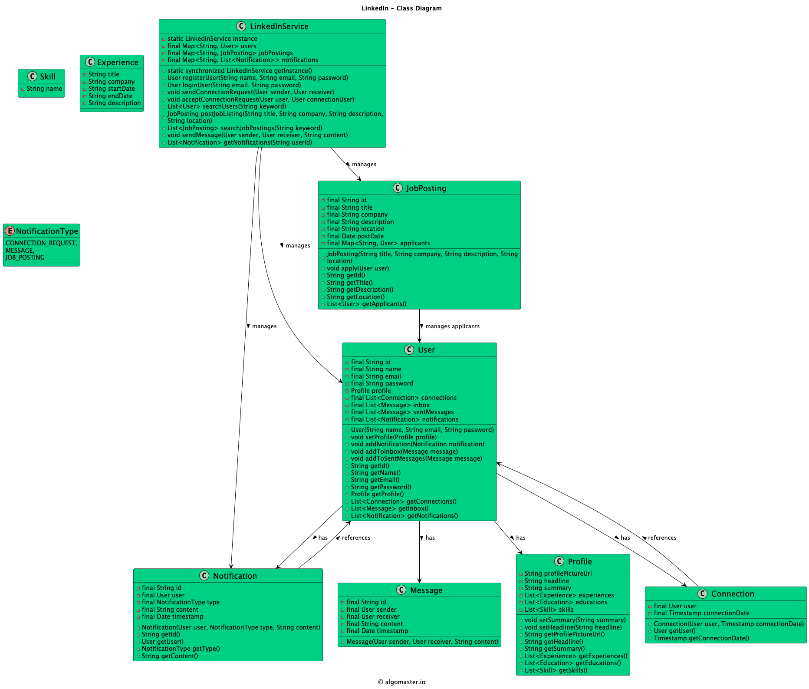

# Designing a Professional Networking Platform like LinkedIn

## Requirements
#### User Registration and Authentication:
- Users should be able to create an account with their professional information, such as name, email, and password.
- Users should be able to log in and log out of their accounts securely.
#### User Profiles:
- Each user should have a profile with their professional information, such as profile picture, headline, summary, experience, education, and skills.
- Users should be able to update their profile information.
#### Connections:
- Users should be able to send connection requests to other users.
- Users should be able to accept or decline connection requests.
- Users should be able to view their list of connections.
#### Messaging:
- Users should be able to send messages to their connections.
- Users should be able to view their inbox and sent messages.
#### Job Postings:
- Employers should be able to post job listings with details such as title, description, requirements, and location.
- Users should be able to view and apply for job postings.
#### Search Functionality:
- Users should be able to search for other users, companies, and job postings based on relevant criteria.
- Search results should be ranked based on relevance and user preferences.
#### Notifications:
- Users should receive notifications for events such as connection requests, messages, and job postings.
- Notifications should be delivered in real-time.
#### Scalability and Performance:
- The system should be designed to handle a large number of concurrent users and high traffic load.
- The system should be scalable and efficient in terms of resource utilization.

## UML Class Diagram

## Implementations
#### [Java Implementation](../solutions/java/src/linkedin/) 
#### [Python Implementation](../solutions/python/linkedin/)
#### [C++ Implementation](../solutions/cpp/linkedin/)
#### [C# Implementation](../solutions/csharp/linkedin/)
#### [Go Implementation](../solutions/golang/linkedin/)

## Classes, Interfaces and Enumerations
1. The **User** class represents a user in the LinkedIn system, containing properties such as ID, name, email, password, profile, connections, inbox, and sent messages.
2. The **Profile** class represents a user's profile, containing properties such as profile picture, headline, summary, experiences, educations, and skills.
3. The **Experience**, **Education**, and **Skill** classes represent different components of a user's profile.
4. The **Connection** class represents a connection between two users, containing the user and the connection date.
5. The **Message** class represents a message sent between users, containing properties such as ID, sender, receiver, content, and timestamp.
6. The **JobPosting** class represents a job listing posted by an employer, containing properties such as ID, title, description, requirements, location, and post date.
7. The **Notification** class represents a notification generated for a user, containing properties such as ID, user, notification type, content, and timestamp.
8. The **NotificationType** enum defines the different types of notifications, such as connection request, message, and job posting.
9. The **LinkedInService** class is the main class that manages the LinkedIn system. It follows the Singleton pattern to ensure only one instance of the service exists.
10. The **LinkedInService** class provides methods for user registration, login, profile updates, connection requests, job postings, user and job search, messaging, and notifications.
11. Multi-threading is achieved using concurrent data structures such as ConcurrentHashMap and CopyOnWriteArrayList to handle concurrent access to shared resources.
12. The **LinkedInDemo** class demonstrates the usage of the LinkedIn system by registering users, logging in, updating profiles, sending connection requests, posting job listings, searching for users and jobs, sending messages, and retrieving notifications.