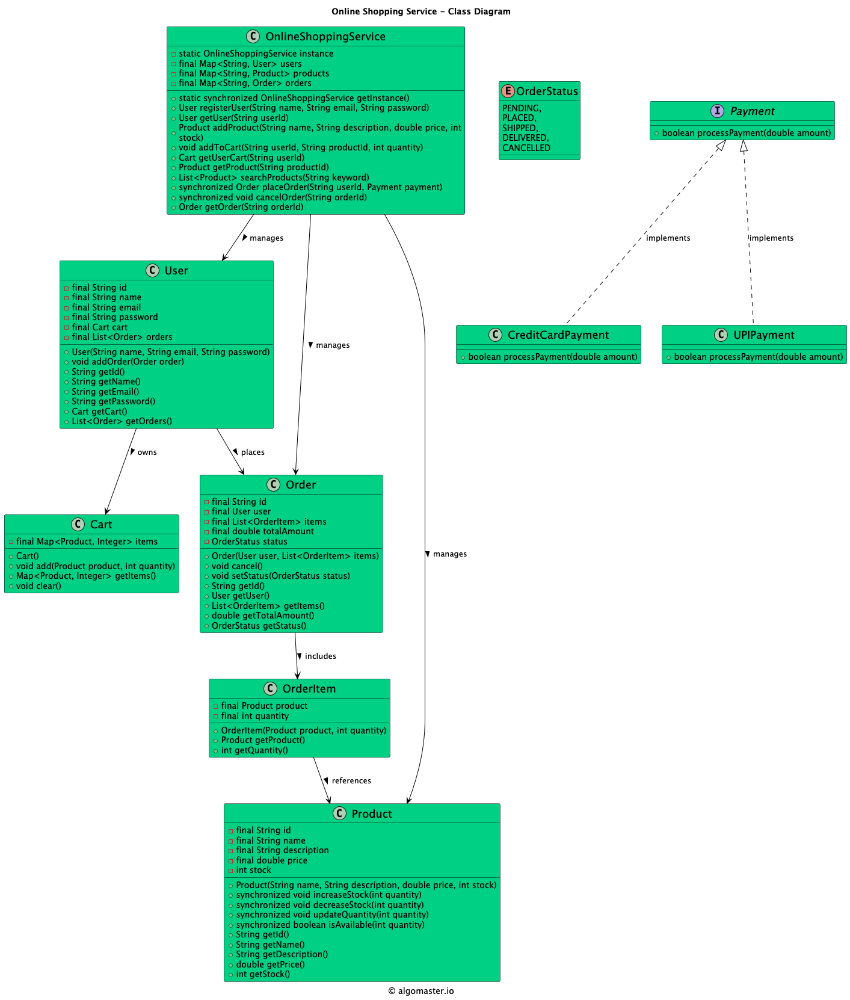

# Designing an Online Shopping System Like Amazon

## Requirements
1. The online shopping service should allow users to browse products, add them to the shopping cart, and place orders.
2. The system should support multiple product categories and provide search functionality.
3. Users should be able to manage their profiles, view order history, and track order status.
4. The system should handle inventory management and update product availability accordingly.
5. The system should support multiple payment methods and ensure secure transactions.
6. The system should handle concurrent user requests and ensure data consistency.
7. The system should be scalable to handle a large number of products and users.
8. The system should provide a user-friendly interface for a seamless shopping experience.

## UML Class Diagram

## Implementations
#### [Java Implementation](../solutions/java/src/onlineshoppingservice/)
#### [Python Implementation](../solutions/python/onlineshoppingservice/)
#### [C++ Implementation](../solutions/cpp/onlineshoppingservice/)
#### [C# Implementation](../solutions/csharp/onlineshoppingservice/)
#### [Go Implementation](../solutions/golang/onlineshoppingservice/)

## Classes, Interfaces and Enumerations
1. The **User** class represents a user in the online shopping service, with properties such as ID, name, email, password, and a list of orders.
2. The **Product** class represents a product available for purchase, with properties like ID, name, description, price, and quantity. It provides methods to update the quantity and check product availability.
3. The **Order** class represents an order placed by a user, containing properties such as ID, user, order items, total amount, and order status. It calculates the total amount based on the order items.
4. The **OrderItem** class represents an item within an order, consisting of the product and the quantity ordered.
5. The **OrderStatus** enum represents the different statuses an order can have, such as pending, processing, shipped, delivered, or cancelled.
6. The **ShoppingCart** class represents the user's shopping cart, allowing them to add, remove, and update item quantities. It maintains a map of product IDs and order items.
7. The **Payment** interface defines the contract for processing payments, with a concrete implementation CreditCardPayment.
8. The **OnlineShoppingService** class is the central component of the online shopping service. It follows the Singleton pattern to ensure only one instance of the service exists. It provides methods to register users, add products, search products, place orders, and retrieve order information. It handles concurrent access to shared resources using synchronization.
9. The **OnlineShoppingServiceDemo** class demonstrates the usage of the online shopping service by registering users, adding products, searching for products, placing orders, and viewing order history.