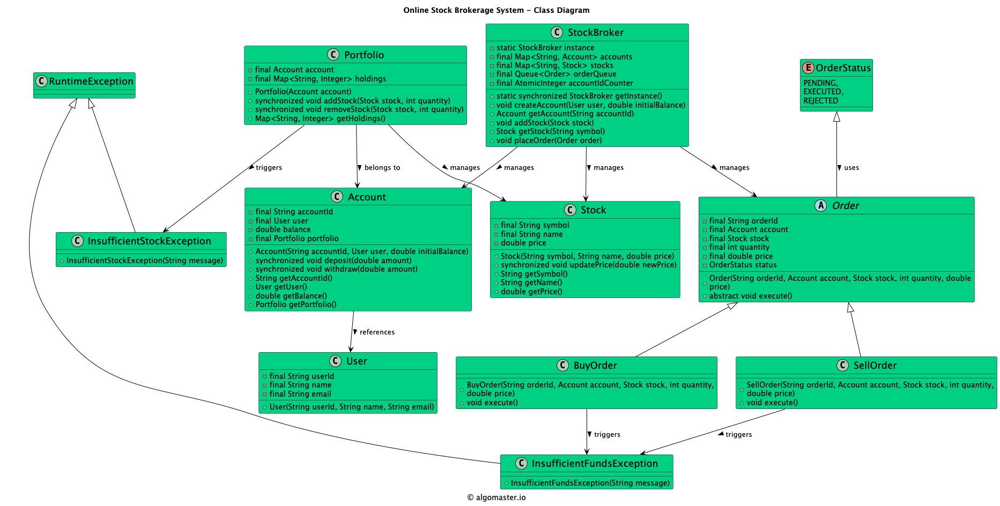

# Designing an Online Stock Brokerage System

## Requirements
1. The online stock brokerage system should allow users to create and manage their trading accounts.
2. Users should be able to buy and sell stocks, as well as view their portfolio and transaction history.
3. The system should provide real-time stock quotes and market data to users.
4. The system should handle order placement, execution, and settlement processes.
5. The system should enforce various business rules and validations, such as checking account balances and stock availability.
6. The system should handle concurrent user requests and ensure data consistency and integrity.
7. The system should be scalable and able to handle a large number of users and transactions.
8. The system should be secure and protect sensitive user information.

## UML Class Diagram

## Implementations
#### [Java Implementation](../solutions/java/src/onlinestockbrokeragesystem/) 
#### [Python Implementation](../solutions/python/onlinestockbrokeragesystem/)
#### [C++ Implementation](../solutions/cpp/onlinestockbrokeragesystem/)
#### [C# Implementation](../solutions/csharp/onlinestockbrokeragesystem/)
#### [Go Implementation](../solutions/golang/onlinestockbrokeragesystem/)

## Classes, Interfaces and Enumerations
1. The **User** class represents a user of the stock brokerage system, with properties such as user ID, name, and email.
2. The **Account** class represents a user's trading account, with properties like account ID, associated user, and balance. It provides methods for depositing and withdrawing funds.
3. The **Stock** class represents a stock that can be traded, with properties such as symbol, name, and price. It provides a method for updating the stock price.
4. The **Order** class is an abstract base class representing an order placed by a user. It contains common properties such as order ID, associated account, stock, quantity, price, and order status. The execute() method is declared as abstract, to be implemented by concrete order classes.
5. The **BuyOrder** and **SellOrder** classes are concrete implementations of the Order class, representing buy and sell orders respectively. They provide the implementation for the execute() method specific to each order type.
6. The **OrderStatus** enum represents the possible statuses of an order, such as PENDING, EXECUTED, or REJECTED.
7. The **Portfolio** class represents a user's portfolio, which holds the stocks owned by the user. It provides methods for adding and removing stocks from the portfolio.
8. The **StockBroker** class is the central component of the stock brokerage system. It follows the Singleton pattern to ensure a single instance of the stock broker. It manages user accounts, stocks, and order processing. It provides methods for creating accounts, adding stocks, placing orders, and processing orders.
9. The **InsufficientFundsException** and **InsufficientStockException** classes are custom exceptions used to handle insufficient funds and insufficient stock scenarios respectively.
10. The **StockBrokerageSystem** class serves as the entry point of the application and demonstrates the usage of the stock brokerage system.