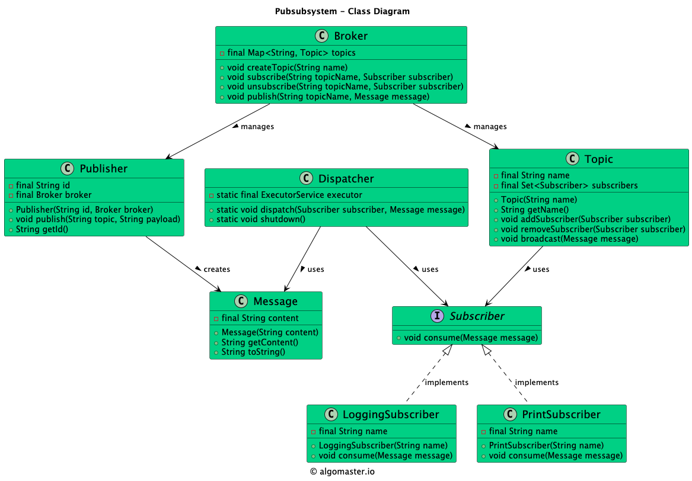

# Designing a Pub-Sub System in Java

## Requirements
1. The Pub-Sub system should allow publishers to publish messages to specific topics.
2. Subscribers should be able to subscribe to topics of interest and receive messages published to those topics.
3. The system should support multiple publishers and subscribers.
4. Messages should be delivered to all subscribers of a topic in real-time.
5. The system should handle concurrent access and ensure thread safety.
6. The Pub-Sub system should be scalable and efficient in terms of message delivery.

## UML Class Diagram

## Implementations
#### [Java Implementation](../solutions/java/src/pubsubsystem/)
#### [Python Implementation](../solutions/python/pubsubsystem/)
#### [C++ Implementation](../solutions/cpp/pubsubsystem/)
#### [C# Implementation](../solutions/csharp/pubsubsystem/)
#### [Go Implementation](../solutions/golang/pubsubsystem/)

## Classes, Interfaces and Enumerations
1. The **Message** class represents a message that can be published and received by subscribers. It contains the message content.
2. The **Topic** class represents a topic to which messages can be published. It maintains a set of subscribers and provides methods to add and remove subscribers, as well as publish messages to all subscribers.
3. The **Subscriber** interface defines the contract for subscribers. It declares the onMessage method that is invoked when a subscriber receives a message.
4. The **PrintSubscriber** class is a concrete implementation of the Subscriber interface. It receives messages and prints them to the console.
5. The **Publisher** class represents a publisher that publishes messages to a specific topic.
6. The **PubSubSystem** class is the main class that manages topics, subscribers, and message publishing. It uses a ConcurrentHashMap to store topics and an ExecutorService to handle concurrent message publishing.
7. The **PubSubDemo** class demonstrates the usage of the Pub-Sub system by creating topics, subscribers, and publishers, and publishing messages.
