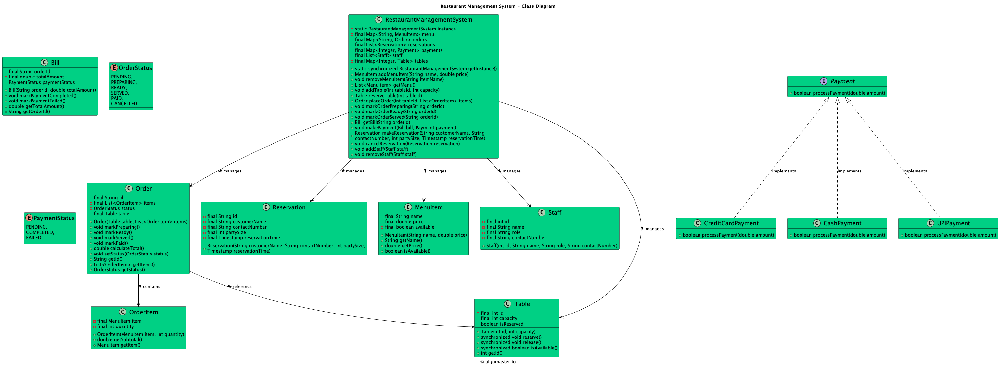

# Designing Restaurant Management System

## Requirements
1. The restaurant management system should allow customers to place orders, view the menu, and make reservations.
2. The system should manage the restaurant's inventory, including ingredients and menu items.
3. The system should handle order processing, including order preparation, billing, and payment.
4. The system should support multiple payment methods, such as cash, credit card, and mobile payments.
5. The system should manage staff information, including roles, schedules, and performance tracking.
6. The system should generate reports and analytics for management, such as sales reports and inventory analysis.
7. The system should handle concurrent access and ensure data consistency.

## UML Class Diagram

## Implementations
#### [Java Implementation](../solutions/java/src/restaurantmanagementsystem/) 
#### [Python Implementation](../solutions/python/restaurantmanagementsystem/)
#### [C++ Implementation](../solutions/cpp/restaurantmanagementsystem/)
#### [C# Implementation](../solutions/csharp/restaurantmanagementsystem/)
#### [Go Implementation](../solutions/golang/restaurantmanagementsystem/)

## Classes, Interfaces and Enumerations
1. The **MenuItem** class represents a menu item in the restaurant, with properties such as ID, name, description, price, and availability.
2. The **Order** class represents an order placed by a customer, with properties such as ID, list of menu items, total amount, order status, and timestamp.
3. The **OrderStatus** enum represents the different statuses an order can have, such as pending, preparing, ready, completed, or cancelled.
4. The **Reservation** class represents a reservation made by a customer, with properties such as ID, customer name, contact number, party size, and reservation time.
5. The **Payment** class represents a payment made for an order, with properties such as ID, amount, payment method, and payment status.
6. The **PaymentMethod** enum represents the different payment methods supported by the restaurant, such as cash, credit card, or mobile payment.
7. The **PaymentStatus** enum represents the status of a payment, which can be pending, completed, or failed.
8. The Staff class represents a staff member of the restaurant, with properties such as ID, name, role, and contact number.
9. The **Restaurant** class is the main class that manages the restaurant operations. It follows the Singleton pattern to ensure only one instance of the restaurant exists.
10. The Restaurant class provides methods for managing menu items, placing orders, updating order status, making reservations, processing payments, and managing staff.
11. Multi-threading is implemented using concurrent data structures (ConcurrentHashMap and CopyOnWriteArrayList) to handle concurrent access to shared data, such as orders and reservations.
12. The notifyKitchen and notifyStaff methods are placeholders for notifying relevant staff about order updates and status changes.
13. The **RestaurantManagementDemo** class demonstrates the usage of the restaurant management system by adding menu items, placing an order, making a reservation, processing a payment, updating order status, adding staff, and retrieving the menu.