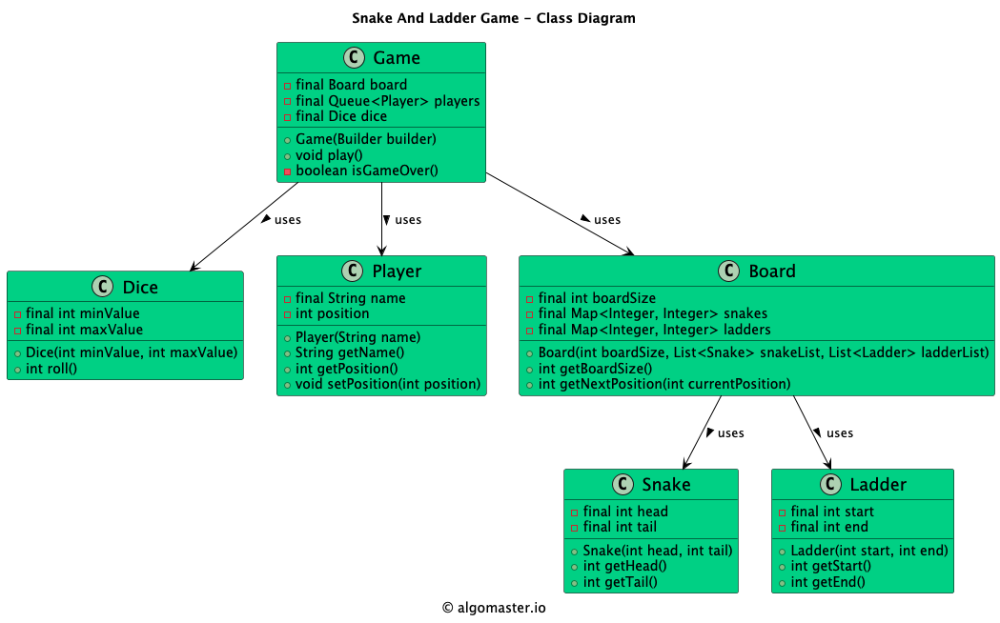

# Designing Snake and Ladder Game

## Requirements
1. The game should be played on a board with numbered cells, typically with 100 cells.
2. The board should have a predefined set of snakes and ladders, connecting certain cells.
3. The game should support multiple players, each represented by a unique game piece.
4. Players should take turns rolling a dice to determine the number of cells to move forward.
5. If a player lands on a cell with the head of a snake, they should slide down to the cell with the tail of the snake.
6. If a player lands on a cell with the base of a ladder, they should climb up to the cell at the top of the ladder.
7. The game should continue until one of the players reaches the final cell on the board.
8. The game should handle multiple game sessions concurrently, allowing different groups of players to play independently.

## UML Class Diagram

## Implementations
#### [Java Implementation](../solutions/java/src/snakeandladdergame/) 
#### [Python Implementation](../solutions/python/snakeandladdergame/)
#### [C++ Implementation](../solutions/cpp/snakeandladdergame/)
#### [C# Implementation](../solutions/csharp/snakeandladdergame/)
#### [Go Implementation](../solutions/golang/snakeandladdergame/)

## Classes, Interfaces and Enumerations
1. The **Board** class represents the game board with a fixed size (e.g., 100 cells). It contains the positions of snakes and ladders and provides methods to initialize them and retrieve the new position after encountering a snake or ladder.
2. The **Player** class represents a player in the game, with properties such as name and current position on the board.
3. The **Snake** class represents a snake on the board, with properties for the start and end positions.
4. The **Ladder** class represents a ladder on the board, with properties for the start and end positions.
5. The **Dice** class represents a dice used in the game, with a method to roll the dice and return a random value between 1 and 6.
6. The **SnakeAndLadderGame** class represents a single game session. It initializes the game with a board, a list of players, and a dice. The play method handles the game loop, where players take turns rolling the dice and moving their positions on the board. It checks for snakes and ladders and updates the player's position accordingly. The game continues until a player reaches the final position on the board.
7. The **GameManager** class is a singleton that manages multiple game sessions. It maintains a list of active games and provides a method to start a new game with a list of player names. Each game is started in a separate thread to allow concurrent game sessions.
8. The **SnakeAndLadderDemo** class demonstrates the usage of the game by creating an instance of the GameManager and starting two separate game sessions with different sets of players.