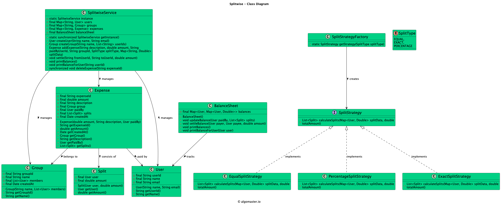

# Designing Splitwise

## Requirements
1. The system should allow users to create accounts and manage their profile information.
2. Users should be able to create groups and add other users to the groups.
3. Users should be able to add expenses within a group, specifying the amount, description, and participants.
4. The system should automatically split the expenses among the participants based on their share.
5. Users should be able to view their individual balances with other users and settle up the balances.
6. The system should support different split methods, such as equal split, percentage split, and exact amounts.
7. Users should be able to view their transaction history and group expenses.
8. The system should handle concurrent transactions and ensure data consistency.

## UML Class Diagram

## Implementations
#### [Java Implementation](../solutions/java/src/splitwise/)
#### [Python Implementation](../solutions/python/splitwise/)
#### [C++ Implementation](../solutions/cpp/splitwise/)
#### [C# Implementation](../solutions/csharp/splitwise/)
#### [Go Implementation](../solutions/golang/splitwise/)

## Classes, Interfaces and Enumerations
1. The **User** class represents a user in the Splitwise system, with properties such as ID, name, email, and a map to store balances with other users.
2. The **Group** class represents a group in Splitwise, containing a list of member users and a list of expenses.
3. The **Expense** class represents an expense within a group, with properties such as ID, amount, description, the user who paid, and a list of splits.
4. The **Split** class is an abstract class representing the split of an expense. It is extended by EqualSplit, PercentSplit, and ExactSplit classes to handle different split methods.
5. The **Transaction** class represents a transaction between two users, with properties such as ID, sender, receiver, and amount.
6. The **SplitwiseService** class is the main class that manages the Splitwise system. It follows the Singleton pattern to ensure only one instance of the service exists.
7. The SplitwiseService class provides methods for adding users, groups, and expenses, splitting expenses, updating balances, settling balances, and creating transactions.
8. Multi-threading is achieved using concurrent data structures such as ConcurrentHashMap and CopyOnWriteArrayList to handle concurrent access to shared resources.
9. The **SplitwiseDemo** class demonstrates the usage of the Splitwise system by creating users, a group, adding an expense, settling balances, and printing user balances.